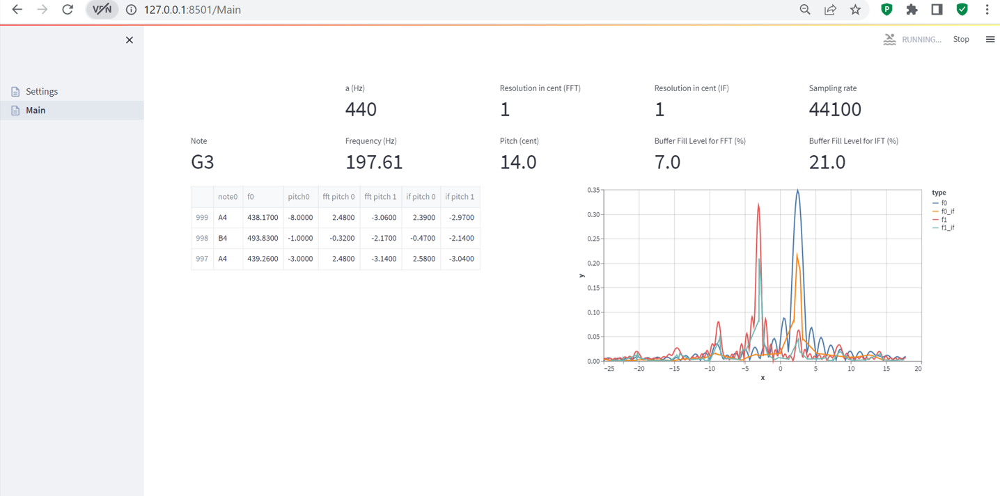

# yaepimet
Yet another elementary pitch measuring tool.

A simple tuning application with two  convenience features, which might be relevant in particular
for the tuning process of a bandoneon:
1) The pitch values are tracked in a table for later reference so that it is not necessary to take manual notes.

2) In addition, the amplitude spectrum of the base frequency as well as the first
   octave are computed (resolution is adjustable). The idea is, that this might be useful to tune upper and lower octave at
   the same time without having to mute one of them.

Remarks:
1) The frequency/time resolution tradeoff is a well known practical limitation of the FFT.
   For example tuning the lowest note of the bandoneon at .1 cent resolution requires roughly 
   a sample of 288 seconds. Hence, we also provide the instantaneous frequency computation, which seems to work very well
   for the use case and only requires a fraction of the sample size.
2) There are many internal parameters which can probably be optimized. Whether the current setup is useful for
   practical usage needs to be evaluated.

# Installation/Setup

- Docker (e.g. Docker Desktop) needs to be installed and running.
- In a terminal, navigate to the directory with the sources and run:
  ````
  docker-compose build
  docker-compose up
  ````
- Then open a browser and navigate to ``127.0.0.1:8501``
- Assumes RTP audio input on port 5005 via UDP in format PCM S16LE, 44.1kHz, single channel.
  - With ffmpeg such a stream can be set up from the terminal as follows:
   
    ``./ffmpeg -thread_queue_size 4069 -f FORMAT -i audio=NAMEOFMICROPHONE -acodec pcm_s16le -ab 44.1k -ac 1 -f rtp rtp://127.0.0.1:5005`` 
  - Here ``FORMAT`` depends on the OS: 
    - Windows: ``FORMAT``=``dshow``
    - MacOS: ``FORMAT``=``avfoundation``
  - The audio device ``NAMEOFMICROPHONE`` can be found through
    
    ``./ffmpeg.exe -list_devices true -f FORMAT -i dummy``.
  
    - On Windows ``NAMEOFMICROPHONE`` refers to the device name, e.g. ``"Microphone Array (Realtek High Definition Audio)"``.
    - On MacOS: ``NAMEOFMICROPHONE`` refers to the device number, e.g. ``":1"``.
         
# Basics
- On the first page the settings can be adjusted.
- Navigating to the `Main` tab starts the application. Settings can be changed by stopping the application (upper right corner)
  and going back to the first page.

- The application shows the following data:
  - First row:
    - The currently active configuration.
  - Second row:
    - The currently detected note, frequency, pitch as determined by the YIN algorithm.
    - As well as the current fill level of the buffer for the FFT/IF computation.
      The target size of this buffer depends on the chosen frequency resolution and the current base frequency.
      Lower frequency or higher resolution imply both a larger buffer size.
  - Third row:
    - As soon as the buffer is full, the FFT/IF is computed and the amplitude spectrum for base frequency and first octave are displayed. The unit of the x-Axis is cent.
    - All computed values are stored in a table and displayed on the left hand side for later usage.




# Acknowledgments
- Obviously the app makes essential use of various fantastic open source projects, among others:
  - streamlit
  - librosa
  - asyncio

# Todos
- Implement audio input directly from browser.
